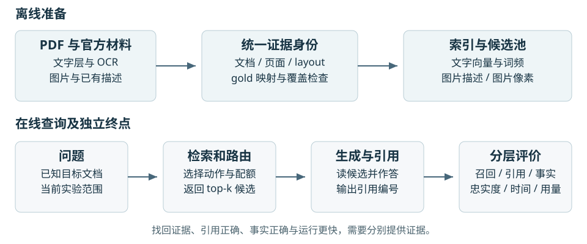
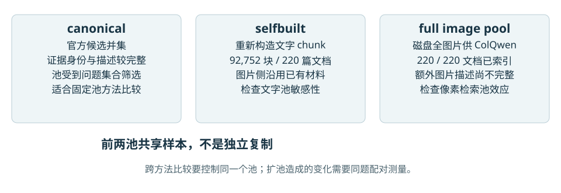
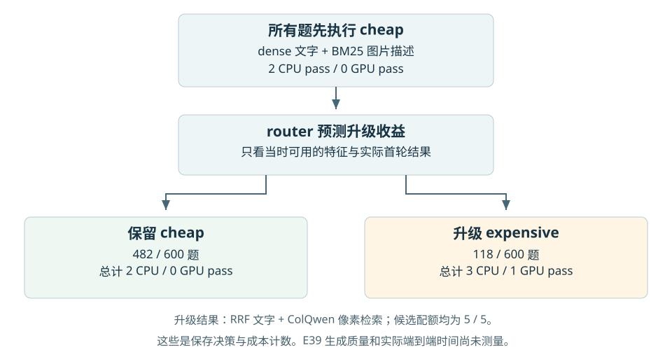
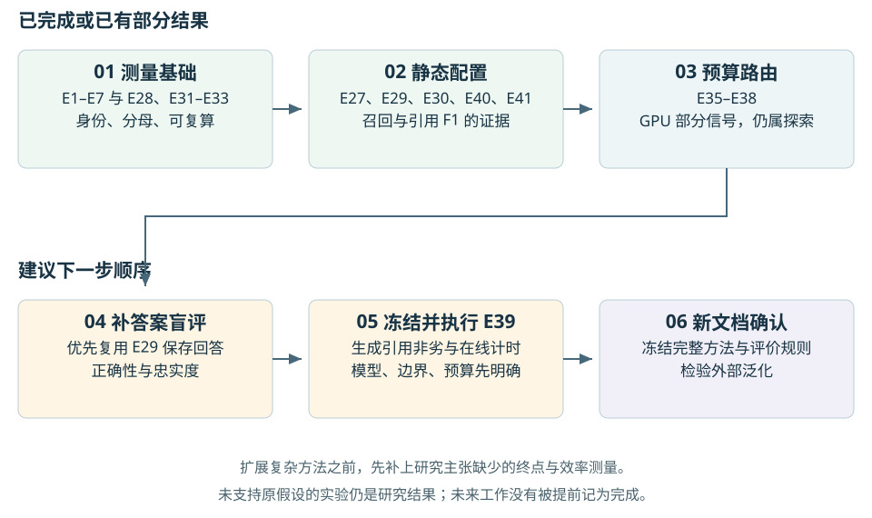

# MMDocRAG 项目实现与实验路线详解

从原论文到本地实现的研究说明与阅读路线

更新日期：2026 年 9 月 6 日。实验数字以 2026 年 9 月 5 日保存的复算结果为主要依据。

## 1 先建立项目的整体认识

这个项目研究的是：面对包含正文、表格、图表和图片的长文档，怎样在有限的证据和计算预算下，找出回答问题所需的内容，并让生成模型正确使用它们。

原始 MMDocRAG 主要提供数据集、任务定义、基准比较和生成评测代码。你的工作在这个基础上增加了统一证据身份、重新构建的检索池、检索器与配额比较、逐题路由实验、粒度实验，以及可追溯的运行和统计审计。它是一项研究型原型工作，而不是已经完成所有能力验证的产品。

目前最有支撑的结果是：**在本地论文式基线之上，改进静态检索配置能提高证据召回；一项配对生成实验还观察到引用片段选择 F1 的提升。** 逐题路由方面，CPU 路由没有得到稳定收益，GPU 升级决策存在部分信号。答案正确性、忠实度和实际端到端时延仍需补测。

这里的“你的实现”指当前研究分支中的实现与实验，不表示每个底层模型、数据解析器或检索思想都由你原创。BM25、BGE、ColQwen、RRF 是使用的组件；研究贡献来自问题如何被拆解、比较怎样受到控制、哪些结论得到或没有得到支持，以及可复核的实现。

### 1.1 一道题经过哪些环节

用一个虚构的教学例子理解流程。问题是：“这份年报中，欧洲业务收入从 2022 年到 2023 年增加了多少，主要原因是什么？”正确回答可能同时需要一张收入表和一段解释增长原因的正文。

1. 解析文档，把正文和图表变成带来源位置的证据单元。
2. 检索器根据问题排列这些证据，选出有限数量的候选。
3. 配额决定候选中保留多少文字、多少图片；路由器可以决定是否追加某种检索。
4. 生成模型阅读候选，计算收入差值，解释原因，并标注文字和图片引用。
5. 评价分别检查证据有没有找全、引用有没有选对、答案有没有答对、结论是否受证据支持、花了多少资源。

如果收入表没有被检索出来，生成模型通常缺少必要依据；如果表已经给出，模型仍可能算错增长额；如果计算正确，却引用了另一张表，引用质量又会出问题。**检索、引用、正确性和忠实度是相连的环节，也是不同的评价对象。**



### 1.2 三种阅读路线

| 你的目的 | 建议顺序 | 阅读后应能回答的问题 |
|---|---|---|
| 先理解研究故事 | 第 1、2、5、6、10 节 | 为什么开始做路由，后来为什么转向静态配置和预算级联 |
| 准备论文或答辩 | 第 3、6、7、9、10、11 节 | 每项主张由什么实验支持，哪些地方必须限定范围 |
| 读代码并接手实验 | 第 4、7、8、12 节，再按编号查附录 | 输入在哪里、参数改变什么、怎样复算并核对结果 |

文中的 E1–E41 是实验注册编号。编号不严格等于研究先后顺序，例如 E40 是对 E27 的强编码器复核。阅读时应先看研究问题，再看编号。

## 2 原论文和官方实现分别做了什么

### 2.1 论文的研究对象

MMDocRAG 是长文档多模态 RAG 基准，包含 4,055 道问答，开发集 2,055 题、评测集 2,000 题。证据有页级和细粒度 quote 级标注，答案可以在文字中穿插已有图片。论文既考察检索，又考察模型从含干扰项的候选中选择引用和生成答案的能力。[原论文正文](https://arxiv.org/html/2505.16470v2)

论文的固定候选设置包括 C15，即 10 条文字与 5 条图片，以及 C20，即 12 条文字与 8 条图片。检索混合基线在 k=10、15、20 时采用文字/图片配额 7/3、10/5、12/8。附录 C.3 Table 14 明确列出 BGE-large-en-v1.5 和 ColQwen2-v0.1；不能继续沿用“论文没有给检索器版本”的旧说法。[原论文附录](https://arxiv.org/html/2505.16470v2#A3.SS3)

论文表中的文档数是 222，本地 canonical 数据层统计为 223，主要检索评价涉及 220。本文分别标注这三个范围，不把它们写成同一个分母；版本或文档身份差异的具体原因仍需单独对账。

### 2.2 从仓库代码看官方流程

以下是对本地保留的上游文件和接口的解释。仓库已经加入过工程修复，因此这里说明的是当前可读到的实现路径，不把每一行当前代码都归于原作者。

**输入数据。** `dataset/` 下的评测 JSONL 每行包含问题、所属文档、文字候选、图片候选、gold 引用和答案。图片候选既有图片资源，也可以带文字描述。C15/C20 中 gold 与 hard negatives 混在一起；hard negative 是看起来相关、实际上不属于该题标注证据的干扰项。

**生成提示。** `prompt_bank/pure_text_infer.txt` 要求模型阅读文字与图片描述，选相关证据，并输出带 `[1]` 这类文字引用和 `` 这类图片引用的回答。`multimodal_infer.txt` 则配合图文输入。pure-text 模式仍能输出图片引用，因为模型引用的是已提供图片的编号；它并不需要从零生成图片，也不意味着输入时读过像素。

**模型调用。** `inference_api.py` 负责通过 API 生成；`inference_checkpoint.py` 对接本地模型检查点。`--setting` 选择候选设置，`--mode` 决定图片以像素还是文字表示进入生成器。`response/` 保存模型输出，随后评价脚本读取这些输出，而不是每次评分都重新请求模型。

**自动评价。** `eval_all.py` 提取文字与图片引用，把预测引用集合与 gold 集合比较，计算 precision、recall 和 F1，同时保留 BLEU、ROUGE-L 等文本相似度计算路径。`eval_llm_judge.py` 是另一条模型评审路径。某条实验运行了自动引用评价，并不意味着也运行了 judge 或人工正确性评价。

**微调路径。** `train_swift_qwen.py` 提供基于 ms-swift 和 LoRA 的训练入口，使用 `dataset/train.jsonl`。当前脚本有 rank=16、alpha=32、最大序列长度 8192、学习率 1e-4、1 个 epoch、每设备 batch=2、梯度累积 4 等设置。这是代码中的训练配置；本项目主要实验没有据此完成一套新的生成模型微调。不能把仓库“有训练脚本”写成“我们训练了模型”。

对应来源：[本地 README](../README.md)、[API 推理](../inference_api.py)、[引用评价](../eval_all.py)、[训练脚本](../train_swift_qwen.py)、[上游仓库](https://github.com/MMDocRAG/MMDocRAG)。

### 2.3 固定候选评测和检索评测有什么不同

固定候选评测相当于老师已经把 20 份材料放到桌上，其中包含答案需要的材料，考察学生会不会选对并使用。检索评测则先要求系统从文档里的更多材料中找出这 20 份。前者主要隔离生成与证据选择能力；后者增加了“没把必要材料找出来”的失败来源。

因此，复算官方 C20 保存输出得到原表数字，只能证明评分代码与这些保存输出相容。它不能证明你重新运行了论文里的全部检索器，也不能证明新检索系统达到了论文的生成成绩。

## 3 你的实现与原论文怎么对应

### 3.1 原 proposal 的目标

proposal 的总问题是：在固定证据预算下，按问题动态选择模态、检索器和粒度，能否提高召回与忠实度，并减少计算。它设想的三层分别是“找哪种证据”“用哪种检索器”“返回多大块的内容”，另有动态 top-k 扩展。

这是需要实验检验的假设，不是实现完几段 router 代码后就自动成立的结论。现有实验已经说明，简单的直觉规则、逐题 oracle、模型预测分数以及真正改善终点质量之间，有很长一段距离。原 [proposal](Research_Project_Proposal.docx) 也包含后来已更正的研究判断，阅读时以本说明中的当前边界和注册表追加更正为准。

### 3.2 已有组件与未完成能力

| 环节 | 原基准或上游路径 | 本项目实际增加的内容 | 当前边界 |
|---|---|---|---|
| 证据身份 | 设置内的 quote 编号 | canonical 身份与跨设置映射 | 映射成功不等于语义标注绝对正确 |
| 文本池 | 官方候选和文档材料 | PDF 文字抽取、OCR、自建多粒度 chunk | 自建图片描述全池尚未补齐 |
| 文本检索 | 基准中的 dense 等方法 | BM25、BGE、模态内 RRF、参数对照 | 大部分探索仍由 BGE-small 产生 |
| 视觉检索 | 像素检索模型 | 本地 ColQwen2-v1.0 与全图片池索引 | 与论文 v0.1 不同，未完成全部原系统复现 |
| 配额 | 固定 7/3、10/5、12/8 | 固定配额搜索、gold 比例分析、比例预测 | 学到比例不等于获得有用的检索增益 |
| 路由 | 本项目研究问题 | 检索前选择、首轮之后的预算级联 | CPU 负结果，GPU 部分信号 |
| 粒度 | quote 及页面证据 | 字符粒度扫描、预算控制、small-to-big | 主要是文本 BM25，非完整多模态粒度系统 |
| 生成 | API 或本地检查点 | E29 两臂配对生成，E39 候选准备 | E39 尚无回答；正确性与忠实度未测 |
| 复现 | 推理及评价脚本 | 注册表、缓存依赖、输入哈希、源码包、断点续跑、测试 | 保存缓存复算不等于干净环境完整冷启动 |

### 3.3 三种池一定要分清

**canonical 池**是官方题目候选的并集。它方便保留证据身份和图片描述，但一个内容进入池，往往因为它曾被选作某道题的 gold 或干扰项，因此池本身受到问题集合的筛选。池更小、干扰项更少，绝对召回可能更乐观。

**selfbuilt 池**重新从 220 篇 PDF 构造文字 chunk，当前主版本有 92,752 个。图片侧仍使用已有官方图片及描述。这样能检查文字池变化是否改变结论，但不能称为“所有模态都从原文完整重建”。两个池共享题目、文档和图片侧，因此是候选池敏感性复核，不是独立数据复制。

**full image pool**从磁盘枚举文档图片供 ColQwen 像素检索。E34 已覆盖全部 220 篇评测文档。很多额外图片没有 VLM 描述，直接拿全池 ColQwen 与小描述池 BM25 比较，会同时改变方法和干扰项数量。当前做法是把全池的绝对图片召回审计，与同池的方法配对比较分开。



### 3.4 当前研究的检索范围

主要检索脚本先知道该问题对应哪一篇文档，再在这篇文档内部给 quote 排名。它没有同时证明“在一个大型跨文档数据库里先找到正确文档”的能力。若以后部署到任意文档问答，需要另测文档发现、跨文档检索、解析失败和新文档泛化。

## 4 按模块理解代码如何工作

### 4.1 数据层先解决什么叫同一条证据

`canonical/build.py` 把 `(split, q_id)` 作为问题身份，把 `(doc, page, layout)` 对应到稳定证据身份。因为 `text5` 只是当前候选列表的局部编号，同一个 `text5` 换一道题或换一个 setting，可能指向另一段文字；反过来，同一段原文也可能在 C15 是 `text5`、在 C20 是 `text9`。

例如比较两臂回答时，如果只看两边都引用了 `text5`，就断定它们用了相同证据，会产生错误。正确方法是先解析各自候选表，把局部编号还原为同一套来源身份，再比较。

canonical 数据层把问题、证据、候选关系、gold 关系和 setting 相关答案分别保存。全库的 21,978 是包含两种 setting 的 gold 关联记录，不能把它当成 21,978 条互不相同的真实证据。主要评价只取 evaluation 和固定 setting，gold 分母为 5,813。

### 4.2 自建 chunk 与 gold 怎样对齐

`retrieval/quote_corpus.py` 从 PDF 读取文字块，按阅读顺序合并；垂直间距较大时提前断开，避免机械地跨越布局边界。默认目标约 300 字符，弱文字层页面可以使用缓存 OCR。

重新切块后已经没有官方 layout 编号，因此需要把官方 gold 文字匹配到自建 chunk。`canonical/gate2.py` 使用规范化后的字符 8-gram：把文字转换成连续小写字母数字串，再取长度为 8 的连续片段，检查覆盖关系。它比精确子串更能容忍 OCR 和公式解析差异。

这里有两个不同阈值：Gate 2 的 `--overlap` 默认 0.80，用于它自己的覆盖检查；自建 chunk 分配的 `COVER_MIN` 是 0.50，用于将 gold 分配给覆盖最多的单个 chunk。两者回答的映射问题和对象不同，不能把 98.63% 的 Gate 2 数字直接当作所有下游池的映射率。

如果一条 gold 没匹配成功，记录为 unmapped。当前主召回把它计为 miss；不会通过删除难匹配 gold 来提高成绩。

### 4.3 四种检索方法如何进入系统

**BM25**按词语重合程度排序，并考虑词语稀有度、词频饱和和候选长度。精确编号、年份或专有词可能直接形成检索信号。这里“可能”是工作原理解释，不是对所有题型已经证实的最优路由规则。

**BGE dense**把问题和候选文字编码成向量，使用相似度排序。`retrieval/dense.py` 为问题加检索前缀，编码后做向量归一化；主历史模型是 BGE-small-en-v1.5，E40 改用本地 BGE-large-en-v1.5。图片描述也能送入 BGE，因为输入仍是文字。

**RRF**融合 BM25 和 dense 的名次。当前实现对同一候选累加 `1 / (60 + 名次)`，名次从 1 开始。它利用两套排序的互补信息，不要求把 BM25 原分数和 dense 相似度强行当成同一量纲。两个列表中都排得靠前的证据，通常更容易进入最终候选。

**ColQwen**直接读取图片像素，保存多向量表示，用查询 token 与图片 token 的局部匹配进行后交互评分。可把 MaxSim 理解为：对每个查询 token，找到它最匹配的图片 token，再汇总匹配强度。这与先把图片写成一段文字再检索，是不同的信息通路。

来源：[BM25](../retrieval/bm25.py)、[dense 编码](../retrieval/dense.py)、[当前检索组装](../retrieval/eval_stack_v2.py)、[ColQwen 索引](../retrieval/colqwen_index.py)。

### 4.4 模态内融合与跨模态配额是两件事

设 k=10、配额为 4/6。系统先在文字分支中产生排序，在图片分支中产生排序，然后取 4 条文字与 6 条图片。文字分支内部可以用 RRF，图片描述分支内部也可以用 RRF。

因此，“融合”决定每个分支里谁排前面，“配额”决定每个分支获得几个位置。它们不是一个超参数。E30 分开考察这些因素，就是为了知道整体变化由哪些组件贡献，而不是把所有改动一次打包后归功于 router。

实验图表里的系统字母也不是实验编号：例如对照臂 E 是 dense 文字加 ColQwen 图片，采用本地论文式配额；它不等于 E5 或实验集合 E。对照臂 A 是 dense 文字加 dense 图片描述的替代基线。报告 E40 主结果应使用相对 E 的差值。

### 4.5 路由器到底预测什么

`router/actions.py` 把每道题在不同检索动作下的召回与成本整理为 action 表。一个动作是 `(文字检索器, 图片分支检索器)`。当前空间包括 3 种文字动作与 4 种图片动作，共 12 种组合。

Policy A 在检索前选动作，只能读取当时可用的特征。Policy B 先执行便宜动作，再看该次首轮的分数形状，预测追加昂贵动作会带来多少收益。训练标签来自训练文档上观察到的收益差；测试时不允许读取 gold 或尚未执行的昂贵检索结果。

Phase 3 特征包括：候选池大小等 shape 信息、问题长度和数字等 qtext 信息、句向量 emb、实际首轮分数的 top1、均值、标准差、分数间距等 firstpass 信息。shape 在这个已知目标文档的设定中可直接获得；换到跨文档检索不能不经检查沿用这个“免费”假设。

候选预测器包括常数预测器、带标准化的 Ridge 和浅层梯度提升树。常数预测器提供没有逐题信息时的基线；Ridge 用正则化限制小样本下的过拟合；树模型尝试非线性关系。对这些模型的比较不等于训练了一个新的大语言模型。



### 4.6 如何保证实验还算得回来

`experiments.py` 是注册表，记下每条实验的问题、命令、状态和更正。`expkit/` 负责运行、依赖、缓存身份、结构化结果和源码记录。输入哈希回答“用的是哪份数据”，source bundle 回答“实际跑的是哪份源码”，run ID 把命令、日志和指标连接起来。

缓存不是看到同名文件就复用。模型、输入、池或参数改变后，相关缓存必须重新判定。生成请求尤其如此：同一个 q_id 在不同检索候选下是不同请求，不能借用旧答案冒充新配置的输出。

## 5 研究为什么一步步改变方向

### 5.1 先验证尺子和材料

E1–E7 先检查评分、样本对齐、证据身份、gold 映射和 OCR。没有这些工作，后面“方法提升”可能只是漏评了一批难题、局部编号串了证据，或文本根本没有进入索引。它们的意义是建立测量前提，不是直接提高生成模型的能力。

### 5.2 第一种路由直觉没有被数据支持

最初的直觉是：有些题适合看真图，有些题看图片描述就够。E8–E11 用同一模型的两种输入模式构造 oracle 和路由标签，发现逐题选较好结果确实会得到很大“上界”，但不同模型对哪种模式更好的判断几乎不一致，已测特征也没有捕获稳定收益。

于是研究问题从“预测这题属于哪个模态”转向更具体的“哪些检索动作值得执行”。E12 又发现补 OCR 后文本可达性大幅改善，旧的“文档对文本结构性不可见”论据站不住，需要用实测的检索互补性来支持动机。

### 5.3 有互补性也不代表逐题二选一最好

E13–E18 表明，粒度、池大小和表示方式都会影响表观模态差异。BM25 与 dense 在不同分支上有交叉，但一道题经常同时需要文字和图片。直接二选一还会丢掉另一条路径的有用证据，静态融合反而形成更强的比较门槛。

这一步改变了“创新”的目标：如果 RRF 已经以简单方式拿到互补收益，路由器就必须证明自己能超过 RRF，或者在更少计算下保留足够质量；仅超过某个弱单检索器不够说明它值得部署。

### 5.4 把可争取的空间算清楚

E19–E23 研究配额：是否每题都应该分配不同数量的文字和图片。它们发现最优配额经常有许多并列值，粗暴取一个 argmax 会制造伪标签。用真实模态占比分配有一定收益，但现实特征对该占比的预测能力弱，低维预测改善也没有充分传导到检索收益。

E25–E26 则发现粒度比较高度依赖预算单位。粗块在相同 top-k 下看起来好，可能只是读了更多文字。改用相同 word-like token 预算后，排序会反转；small-to-big 也必须承担返回粗 parent 的上下文成本。

### 5.5 静态改进形成主结果

E27 把更合理的配额和模态内融合组合起来，与本地论文式基线比较。E28 纠正了统计单位、分母和基线称呼，E40 再用更强的 BGE-large 重复主要配置选择评价，E41 复核八项主比较的多重检验。

E29 把两种静态检索候选送给同一个生成器，观察到引用 F1 提升。它回答了“检索变化是否影响生成后的引用选择”，没有单独回答“事实是否更正确”。这正是下一步需要补测的连接点。

### 5.6 路由转向预算级联并得到部分信号

E35 先检查同预算下完美选择是否还有空间，E36 再训练实际路由器。CPU 融合决策缺乏稳定收益，GPU 升级决策有部分信号。E37 说明静态提升在纯视觉证据题上更大；E38 提供一种预测误差假设下的敏感性模拟。

E39 要检验“少调用 ColQwen 后，生成引用质量能否保持在可接受范围”。目前只有候选与路由决策准备完成。这条路径有研究价值，但完整的质量、时延和费用验证链仍未闭合。

## 6 当前最应记住的实验结果

### 6.1 E40 静态配置在强文字编码器上的结果

以下是 BGE-large 下，折外选择配置相对本地论文式基线 E 的结果。Recall 使用逐题无条件召回的均值。差值以**百分点**展示，4,000 次文档 bootstrap 产生 95% CI。

<!-- e40:start -->
| 池 | k | 基线 Recall | OOF Recall | 绝对差百分点 | 95% CI 百分点 |
|---|---|---|---|---|---|
| selfbuilt | 10 | 0.6568 | 0.7173 | +6.05 | [4.66, 7.52] |
| selfbuilt | 20 | 0.7956 | 0.8285 | +3.29 | [2.32, 4.28] |
| canonical | 10 | 0.6909 | 0.7433 | +5.25 | [3.79, 6.72] |
| canonical | 20 | 0.8274 | 0.8541 | +2.67 | [1.73, 3.61] |
<!-- e40:end -->

每格均为 2,000 题、220 篇文档、5,813 条 gold。selfbuilt 中 62 条未映射 gold 计为 miss，因此 mapped=5,751；canonical 全部映射；两池 dropped 都为 0。表内绝对值用于理解本地变化，不能直接拿去宣称超过原论文。

这些结果支持“改进在 BGE-large 上仍存在”。它们不代表 E29、E35、E36、E37 全部换成 BGE-large 重做过；那些历史实验的模型配置仍需各自核对。

### 6.2 E29 生成后的引用选择

| 项目 | 本地论文式静态臂 | 改进静态臂 |
|---|---|---|
| 文字检索 | BGE dense | BM25 与 BGE 的 RRF |
| 图片分支检索 | ColQwen 像素检索 | BM25 与 BGE 的图片描述 RRF |
| 文字与图片配额 | 7/3 | 4/6 |
| 生成输入 | pure-text | pure-text |
| 保存的生成模型名 | gemini-3.6-flash | gemini-3.6-flash |
| 引用 F1 | 55.21 | 58.11 |

600 题、220 篇文档、1,552 条 gold，两臂差为 **+2.8990 个引用 F1 点，95% CI [1.0147, 4.7713]，配对文档 bootstrap p=0.0025**。逐题 210 胜、156 负、234 平。这里的模型名是保存实验的配置记录，不是对当前 API 可用性或价格的声明。

两臂生成器、题目和提示一致，主要差别是检索候选。没有逐题 router 参与 E29。两臂都以文字模式生成，也不矛盾：基线在检索时读图片，选出的图片在生成时转成已有描述。**检索模态与生成输入模态必须分开描述。**

E29 的候选引用已经重新编号，历史 interleaved gold 答案字符串并没有自动变成适合新候选的文本相似度参考。因此当前协议不报告它的 BLEU/ROUGE 作为有效结论。答案正确性和忠实度另见待执行的 [评价协议](ANSWER_EVALUATION_PROTOCOL.md)。

### 6.3 E34 全图片池为什么重要

在 220 篇文档、1,995 道含视觉 gold 的题上，ColQwen 全池图片 Recall@10 为 **0.7824，95% CI [0.7466, 0.8170]**。同题同 gold 的“全池减候选池”差为 **−0.0374，95% CI [−0.0509, −0.0265]**。另有 5 题没有视觉 gold，不属于这项图片召回统计。

增加干扰图片确实降低了召回，说明候选池构造会影响绝对成绩。但论文的 0.708 仍在本地区间之外，不能说只要补齐池就复现了论文。已知还有 ColQwen v1.0 与 v0.1 的差异，以及解析和候选构造差异。区间是否覆盖论文单点也不是正式的跨研究配对检验。

### 6.4 E36 怎样理解部分正结果

E36 主比较是在相同升级预算下，路由器是否比随机选同样多的题升级更好。主要族包含两种决策、两个池和两个 k，共 8 项比较，主检验预算为 B=0.50。

固定低维特征方案时，GPU 决策 3/4 通过 Holm，CPU 0/4。允许在内折中选择特征组后，GPU 变为 1/4，CPU 仍为 0/4。两种报告方式必须同时呈现，不能只挑较好的一组。

它支持“GPU 升级收益含有一些可利用的逐题信号”，也说明信号对特征选择协议敏感。曲线上 B=0.05–0.15 时召回接近静态臂，只是观察到的交点。CI 跨 0 不能用来证明同质量，曲线也没有测实际运行时延。

### 6.5 E39 目前到底到哪一步

状态是 **prepared_not_generated**。当前保存计划采用 canonical、k=10、5/5 配额、BGE-small；cheap 为 dense 文字与 BM25 图片描述，expensive 为 RRF 文字与 ColQwen 图片。

总体 2,000 题按 B=0.15 选出 300 题升级。E39 取出的 600 题中有 118 题升级，实际比例为 19.67%，因此按决策数少调用 80.3% 的 ColQwen。不能把总体 15% 当成这个子集的实际比例。

| 数量 | 当前记录 | 应如何理解 |
|---|---|---|
| 问题和文档 | 600 题、220 文档 | 既定生成子集 |
| gold | 1,552 | 未找回 gold 仍要进入评价分母 |
| 已发生生成 API 调用 | 0 | 尚无 E39 引用质量结果 |
| 两臂基础生成规模 | 1,200 条回答 | 600 题各生成 static 与 routed 回答 |
| 平均 CPU pass | 2.1967，对照 2 | 首轮后升级有额外成本 |
| 平均 GPU pass | 0.1967，对照 1 | 表示检索动作次数，不是秒数 |
| 非劣界 | 暂拟 2 个引用 F1 点 | 尚需理由、功效评估及生成前冻结 |

如果提前冻结相同请求的共享响应规则，两臂有 118 个相同输入时可考虑只生成 1,082 个唯一请求；这属于待确定的设计选择，不能事后按结果挑着复用。另一个方案是生成 static 和 cheap 两套回答，再按冻结路由构造 routed，以同时得到三个评价臂；也必须在生成前明确。现有 plan 的基础计数仍是两臂 1,200。

模型、thinking 设置和 token 上限尚未冻结。E29 的旧回答不能直接替代，因为配额和候选不同。完整依据见 [E39 保存计划](../artifacts/e39/20260905/generation/plan.json)。

## 7 指标到底在衡量什么

### 7.1 Recall@k 是有没有把需要的证据找回来

对一道题，Recall@k 是 top-k 检索结果命中的 gold 数除以该题全部 gold 数。若有 3 条 gold，找回 2 条，召回为 2/3。k 是返回证据条数；每条多长没有被这个数字直接约束。

本项目主表先算每道题的 recall，再平均，叫逐题宏平均。它与“全体命中 gold 数除以全体 gold 数”的微平均不同。例：题 A 有 1 条 gold 且命中，题 B 有 9 条 gold 却全没命中，宏平均为 50%，微平均为 10%。不能未经说明在两种估计量之间切换。

unconditional recall 的分母保留无法映射的 gold；conditional-on-mapped recall 只评价已映射部分。后者可以作为诊断，但必须明确命名。自建池未映射 62 条 gold 不是 62 道题，也不是允许从 gold 分母中扣掉的项目。

### 7.2 引用 precision recall F1 是引用集合选得好不好

TP 是预测引用中属于 gold 的证据，FP 是预测引用中不属于 gold 的证据，FN 是 gold 中没有被引用的证据。Precision=TP/(TP+FP)，Recall=TP/(TP+FN)，F1=2TP/(2TP+FP+FN)。当前代码对相关零分母情形有明确零值处理。

教学例子：gold 是 A、B，模型引用 A、C、D。此时 TP=1、FP=2、FN=1，precision=1/3、recall=1/2、F1=0.4。多引用一些编号不保证分数更高，因为错误引用会增加 FP。

`eval_all.py` 的 `final_f1` 是**把文字和图片引用合成一题的引用集合后算该题 F1，再对题求均值**，最后乘 100 展示。它不是全样本 TP/FP/FN 的微平均，也不是简单把显示的文字 F1 与图片 F1 相加除以二。E29 复用这一实际代码口径并核对两臂均值。

此外，代码单独显示的文字与图片 precision、recall、F1，是把引用加上题目身份后汇总集合计算的分支指标。分支指标与总体 `final_f1` 的聚合口径不同，因此不能拿显示列做简单算术来“复原”总体值。

E29 中检索不到的 gold 保留为不能获得命中奖励的标识。生成器没有看到它，并不意味着该 gold 可以消失；这正使引用 F1 对检索遗漏敏感。

### 7.3 正确性和忠实度为什么不能由 F1 推出

如果模型引用了正确的收入表，却把 120−100 算成 30，它可能引用 F1 很高，答案仍错。如果回答给出一个碰巧正确的数字，但所引表格不支持这个数字，正确性和忠实度又会分离。

正确性检查是否回答了题目要求的事实、数量或推理。忠实度检查重要事实性主张是否被实际使用的证据支持。评价忠实度时还要单列拒答，防止一个总是不作实质回答的系统因“没有无依据主张”获得误导性的高分。

当前正确性/忠实度协议尚未评分。论文或上游有 LLM-as-judge 工具，并不能填补本地新增系统的这项证据缺口。

### 7.4 BLEU ROUGE 和 judge 应怎样看

BLEU 主要衡量词组重合，ROUGE-L 关注最长公共子序列；它们对表述变化和引用格式敏感，不直接验证数字、图表理解或证据支持关系。judge 可以评价更复杂内容，但它自身有误差，需要冻结评审配置并用人工子样本核查。

模型的 reasoning/thinking 文本与最终答案也要分开。引用抽取应针对最终回答；否则推理草稿里曾考虑但最终没有使用的引用，会混入评价。

### 7.5 效应量 CI 和 p 值

0.0605 的召回绝对差等于 6.05 个百分点，不是“相对提高 6.05%”。若基线约 0.6568，改进到约 0.7173，相对提升约为 9.21%。本文主表统一用绝对差，避免换分母造成更好看的表述。

95% 置信区间反映给定抽样和分析流程下估计的不确定性。对于差值，整个区间高于 0 才支持该口径下的正向差异；下界碰到 0 也不能称为显著。CI 包含 0 表示证据不足以排除零差异，不表示两系统已被证明相等。

p 值不是“原假设为真的概率”，也不表示效果大小。10,000 次 bootstrap 得到的 p 有有限精度；E41 八项校正 p 都为 0.0008，不意味着真实概率精确到四位小数且完全相同。

### 7.6 为什么按文档 bootstrap

2,000 道题来自 220 篇文档。同一文档的题共享图表、语言风格、长度和解析质量，不能当成 2,000 个独立来源。

实际流程是先计算每题的配对差，把每篇文档内的差值求和并记录题数；每轮有放回抽取文档，再用“抽中文档的差值总和 / 抽中文档的题数总和”得到一个差值估计。重复后取 2.5% 和 97.5% 分位数。这就是此处的 ratio-of-sums。

这里分子是逐题 recall 或 F1 差的和，分母是题数，不是把所有 gold 一起合并重算微平均。也不能先算每篇文档平均值，再简单平均文档，因为那样会把题数不同的文档强行赋予相同总权重，改变目标估计量。

聚类重采样不保证每一个数据集上的区间都更宽；采用它是因为抽样单位匹配数据来源，而不是为了总得到更保守的数字。

### 7.7 Holm 校正与比较族

同时看很多 k、候选池和模型时，即使没有真实改善，也更容易碰巧看到某项显著。Holm 方法先排序 p 值，再按剩余比较数量调整阈值，用于控制一个比较族中至少一次误报的概率。

比较族必须说清楚：E30 是 12 项主效应比较；E36 的主族是固定预算上的 8 项 router 对随机分配比较；E41 是 E27/E40 两个编码器、两个池、两个 k 的 8 项复核。E41 在看到历史结果后才汇总，属于事后敏感性审计，不能称为预注册，也不是对 E1–E41 所有尝试的全局校正。

### 7.8 OOF 与配置选择的真实含义

OOF 是 out-of-fold，即一题的评价使用没有由该题所在外折选出的配置。E27/E40 按文档分 5 个外折；对每个外折，在其余 4 折上比较预计算的静态配置，选一个后评价留下的外折。

**虽然文件名叫 `nested_cv.py`，当前实现不是严格的外 5 折加内 4 折拟合循环。** 它是在其余训练文档上选择静态配置；保存 metrics 的 protocol 字段也这样声明。E36 的可训练 router 才有外折评价、内折选择模型或特征的循环，默认外 5、内 4。

这避免了本次外折被直接拿来选配置，但无法消除研究者此前反复看过相同数据、据此决定测试哪些方法的历史。因此 E27/E40 是内部探索性 OOF 验证。其 bootstrap 又固定了已保存 OOF 预测，没有在每次重采样里重新运行全部方法开发和模型选择。

### 7.9 Oracle regret capture 和并列最优

Oracle 假设事先知道每题在各动作下的真实结果，再选最高分；真实部署时没有这种信息。Headroom 是 oracle 与强固定基线的距离，regret 是某个实际决策损失的可获得分数。它们必须注明动作空间、预算和参照臂。

如果 k=20 时一题从 8/12 到 12/8 配额都能找全 gold，这些配额全是最优。`argmax` 默认只选第一个，会把“第一个最优”误当成唯一标签。把这种偏置标签打乱后形成的对照，又可能看起来异常糟糕。E19/E35 因此检查完整并列最优集合，并直接评价分数损失。

Capture 常表示从某个基线到 oracle 的空间中拿到了多大比例。E36 应看同预算下 `(router−random)/(oracle−random)`，不是拿任意两个历史差值相除。分母很小时 capture 会不稳定，必须同时报告原始召回差。

### 7.10 R² AUC kappa 各自回答不同问题

R² 衡量比例预测的平方误差相对均值参照改善多少，理想值为 1，可以为负。负数意味着按该评价定义还不如均值预测；R²=0.136 不是“预测对了 13.6% 的题”。即便误差降低，若改正的题都在配额不敏感区，检索收益也可能很小。

分类 ROC-AUC 衡量正例通常是否排在负例前面；约 0.5 表示排序接近随机。项目还有预算—召回曲线的 AUC，代码使用预算网格上的平均曲线值，和分类 ROC-AUC 不是同一个指标。

Cohen's kappa 衡量两套标签超出机会水平的一致性。E9 跨模型 kappa 低，削弱了“存在模型无关的题目模态偏好”这一解释，但不能推出所有未来 router 都不可能有效。

### 7.11 非劣检验与没有显著下降的区别

E39 暂拟允许最多损失 2 个引用 F1 点，考察 routed−static。按当前拟定规则，差值双侧 95% CI 的下界必须严格大于 −2，才可支持这项非劣主张。

教学例子：差值 CI 为 [−1.2, 0.4]，可通过这条已冻结规则；[−2.6, 0.5] 则不能，即使后者也“没有显著下降”。下界恰好为 −2 也不通过。界值必须有实际意义，样本量需考虑文档聚类；看到结果再调整界值会改变研究问题。

## 8 参数和预算速查

### 8.1 检索与语料参数

| 名称 | 当前典型值或来源 | 改变它会影响什么 |
|---|---|---|
| `k` | 主表 10、20，部分诊断用 15 等 | 最多返回多少证据；不是模型 token 上限 |
| `quota` | `(文字数, 图片数)`，两数合计 k | 在两分支之间分配槽位 |
| `PAPER_QUOTA` | 10→7/3，15→10/5，20→12/8 | 本地论文式对照的固定配额 |
| `BALANCED_QUOTA` | 10→5/5，15→8/7，20→10/10 | 名为 balanced 的固定对照；不等于 OOF 每折所选配额 |
| OOF 搜索空间 | 5 种检索组合 × (k+1) 种配额 | k=10 有 55 候选，k=20 有 105 候选 |
| RRF 的 `c` | 60 | 大一些会减弱头部名次差异；本地实现不是 60 条候选截断 |
| BM25 `k1` | 1.5 | 词频重复增加分数时的饱和速度 |
| BM25 `b` | 0.75 | 文本长度归一化强度；b=0 是取消这项归一化 |
| BGE 问题前缀 | 见 `retrieval/dense.py` | 告诉编码器这是检索问题；只对问题侧使用 |
| dense batch | 编码函数默认 128 | 编码吞吐与显存占用，不是返回 128 条证据 |
| 向量归一化 | `normalize_embeddings=True` | 使点积用于比较归一化向量方向 |
| `target-chars` | 自建主池 300 | 文字块目标字符量；不是 300 个 BPE token |
| `GAP_RATIO` | 1.8 | 大布局间隔触发断块的相对阈值 |
| `MIN_CHARS` | 40 | 丢弃过短噪声块的构造阈值，gold 覆盖另行检查 |
| `COVER_MIN` | 0.50 | 将 gold 转移到单个自建 chunk 的最低覆盖 |
| Gate 2 `--overlap` | 0.80 | Gate 2 的字符 8-gram 覆盖判断，与上一项不同 |
| OCR `--min-chars` | 100 | 原文本过少时补 OCR 的页面筛选阈值 |

这些是当前代码或具体实验的设置，不应称为所有场景通用最优值。脚本默认值也不一定是某次实验实际参数，复核时应看该 run 保存的命令和 config。

### 8.2 路由与统计参数

| 名称 | 当前典型值 | 如何理解 |
|---|---|---|
| 升级预算 B | 0 到 1，曲线网格步长 0.05 | 在评价总体中允许升级的题目比例 |
| 主比较预算 | E36 B=0.50 | 统计检验使用的固定预算点，不等于 E39 的 0.15 |
| E39 population B | 0.15 | 总体 300/2,000；子集实际 118/600 |
| Bootstrap 次数 | 常见 4,000；E41 为 10,000 | 重采样次数，不能与升级比例 B 混读 |
| E27/E40 外折数 | 5 | 文档不跨外折；训练文档上选静态配置 |
| E36 外折和内折 | 5 和 4 | 外折测 router，内折选模型及指定的特征方案 |
| Ridge `alpha` | 候选 1、10、100 | 正则化强度，不是 LoRA alpha 或显著性水平 |
| HGB | 深度 3、200 次迭代、学习率 0.05、叶节点至少 40 样本 | 小样本非线性预测器的候选限制 |
| shape 特征 | Phase 3 为 8 维 | 池大小、比例、饱和等；不是 E9 旧 shape 的维数 |
| qtext 特征 | Phase 3 为 8 维 | 问题长度、数字、视觉词等 |
| firstpass 特征 | 两分支各 7 维 | 只允许来自已执行首轮的分数 |
| emb 特征 | BGE-small 384 维，large 1024 维 | 编码器变化会改变维数，不能沿用旧缓存 |
| E38 收缩系数 lambda | 0 到 1 的预设网格 | 0 更依赖预测比例，1 回到固定配额 |
| seed | 检索主路径 20260825，E29 bootstrap 20260829 | 固定随机过程；不代表已做多种子鲁棒性研究 |
| E39 非劣界 | 暂拟 2 个 F1 点 | 尚未冻结和验证的实际容忍损失 |

E38 的规则把预测比例给出的剩余文字槽位与最佳固定文字槽位加权，随后取整并裁剪到合法范围。它选择 lambda 时看了测试收益，因此相关模拟带乐观性，不能拿来证明任何真实预测器都无法更好。

### 8.3 不同成本单位不能换着用

**证据条数**是 top-k。**word-like token**是检索代码的词元计数。**生成 token**由实际模型 tokenizer 和服务端 usage 定义。它们无法按一个通用常数精确换算。

**CPU pass 与 GPU pass**是成本模型里的检索遍历计数。CPU 这个名称并不保证整个 dense 编码阶段从未用 GPU；离线向量生成、在线查询编码和候选评分应另行列明。RRF 需要已有两套排序，本地 pass 计数用于比较动作，不等于真实时间。

E39 cheap 动作需要 2 个 CPU pass；升级后补文字 BM25 并执行 ColQwen，多花 1 个 CPU 与 1 个 GPU pass。若实际升级比例为 r，则平均是 `CPU=2+r，GPU=r`。静态直接运行 RRF 文字与 ColQwen 为 `CPU=2，GPU=1`。被升级题先做过的图片描述 BM25 仍要计费，即使最终使用 ColQwen 结果。

CPU 级联的另一路径是 cheap BM25/BM25 到 RRF/RRF，平均 `CPU=2+2r`。不能将它与 E39 GPU 级联的公式混用，也不能把 CPU 和 GPU 相加成一个没有硬件权重的“总成本”。

**时延**要在实际在线路径测量，按解析/查询编码、CPU 排名、GPU 排名、router、生成等阶段记录。冷启动与预热分开，报告重复次数、中位数与尾部时延。读取已保存 ColQwen 排名的速度不能冒充真正执行 ColQwen 的速度。

**费用**应从实际 `total_tok`、输入/输出/思考 token 及当时核实的模型价格推算，并与提供方记录核对。API 的 `rpm` 是每分钟请求限速，不是质量参数；重试与失败请求可能改变实际调用数，因此 1,200 条目标回答不保证刚好发生 1,200 次计费调用。

### 8.4 模型和生成参数不要与检索参数混淆

| 名称 | 解释 | 在本项目中的位置 |
|---|---|---|
| 模型参数量 | 神经网络的可学习权重规模，例如模型名中的 7B | 不等于向量维数，也不等于输入 token 数 |
| embedding 维数 | 每段文字输出向量的长度 | BGE-small 的 384 与 BGE-large 的 1024 表示不同向量空间 |
| 最大序列长度 | 单次编码或训练可接收的 token 上限 | 过长内容可能截断；以实际模型与 run 配置为准 |
| `max_tokens` 等输出上限 | 单次回答允许生成的最大 token | 过低可能截断答案；E39 仍需冻结具体配置 |
| temperature | 生成采样的随机程度 | 两臂必须匹配，并按具体模型支持的接口保存 |
| thinking | 是否启用及如何限制额外推理计算 | 可能影响质量、时延与用量，不能只写模型名 |
| bf16 | 16 位浮点数表示的一种格式 | 影响模型权重和计算显存，不改变证据条数定义 |
| 4-bit 量化 | 用更低位宽近似部分模型权重 | 可以减内存，但属于不同推理配置，不能默认与原精度等价 |
| LoRA rank | 低秩适配矩阵的秩，当前训练入口为 16 | 控制新增可训练适配容量；本研究主结果没有执行这条微调路径 |
| LoRA alpha | 适配更新的缩放参数，入口为 32 | 与 Ridge 正则化、显著性水平不是同一个 alpha |
| learning rate | 每次优化更新的步幅 | 训练脚本为 1e-4；不是生成时的随机程度 |
| epoch | 训练数据遍历轮数 | 训练入口为 1；存在配置不表示该训练已经完成 |
| batch 与梯度累积 | 每次前向处理的样本数及累积几次再更新 | 入口每设备 batch=2、累积 4；有效 batch 还取决于设备数 |

## 9 实验严谨到什么程度

### 9.1 已经加强的部分

目前主结果已经做到：样本身份配对，gold 分母保留未映射项，文档分组外折评价，按文档重采样，主结果同时给效应量和区间，对指定比较族作 Holm 校正，并保留原始判断与撤回。来源、参数和源码都有对应记录。

这些改进降低了工程错误、分母漂移、直接选择泄漏和多重比较误读的风险。负结果、bug 修复和文献核对也被登记，避免只保留正向实验。

### 9.2 仍然不能省略的限制

| 限制 | 对论文结论的影响 | 下一步怎样补 |
|---|---|---|
| 方法空间在同一数据上开发 | 内部 OOF 仍属探索性 | 冻结方法后使用未参与开发的文档或外部集 |
| 两个池共享样本 | 不能写两次独立复制 | 独立文档来源验证 |
| 候选池受到题目筛选 | 绝对召回不能代表真实全库难度 | 两分支在同一完整池上公平比较 |
| 本地模型版本与论文不同 | 不能声称完整复现或超过原系统 | 固定版本、解析和池管线逐项对齐 |
| E29 只测引用选择 | 不能声称事实更准确或忠实 | 对保存回答执行盲评 |
| E39 没有生成结果 | 不能声称路由生成质量非劣 | 冻结协议并生成配对回答 |
| pass 是离线成本代理 | 不能声称端到端提速 80% | 实际在线计时并列出预计算成本 |
| 纯文本仅 1 题，不可回答 0 题 | 这两类没有可估计的稳健效果 | 新增适当样本或明确排除范围 |
| E38 只有一种误差结构 | 不能排除所有未来特征和方法 | 新模型需单独评价决策收益与错误位置 |

不能笼统说“41 个实验都证明了方法有效”，也不能把所有历史结果都升级为现代统计协议下的确认结论。附录中早期诊断数字用于解释研究转向；用于论文主表时，应沿对应保存 run 核对样本范围、CI 和比较族。

### 9.3 工程通过与科学成立分开看

注册状态 `pass` 表示通过某种检查，`fix` 表示工程修复，`correct` 表示结论更正，`pos` 表示得到正向结果，`neg` 表示负结果或未支持原假设，`pending` 表示待完成。`lifecycle` 的 active、superseded、manual、blocked 则是运行生命周期，和结果方向不同。

当前共 41 项，其中 14 pos、7 neg、7 correct、6 fix、6 pass、1 pending。这是记录的分类，不是“成功率”。E36 被归为 neg，但其中仍有受限定的 GPU 正向信号；用一个颜色无法替代完整阅读。

四组测试此前及本次文档收尾分别核对运行器、源码还原、统计和 Phase 3 行为。测试通过证明被断言的程序性质成立；它不验证 gold 一定正确，也不证明研究有外部泛化。

## 10 理解路线与下一步研究 roadmap

### 10.1 已经走过的路线



| 阶段 | 研究问题 | 主要实验 | 目前产出 |
|---|---|---|---|
| A 测量基础 | 数字与证据身份可信么 | E1–E7 | 评分锚点、canonical、OCR、映射 |
| B 输入与模态诊断 | 是否存在容易学的模态偏好 | E8–E18 | 已测输入路由负结果、粒度和表示边界 |
| C 分配与粒度 | 怎样公平计算可用空间 | E19–E26 | tie 审计、强基线、预算反转 |
| D 静态主结果 | 融合和配额是否真的有收益 | E27–E30、E34、E40、E41 | 内部 OOF 召回提升、引用 F1 提升 |
| E 预算路由 | 把昂贵检索留给哪些题 | E35–E38 | CPU 负结果、GPU 部分信号、切片与模拟 |
| F 终点评价 | 少调用后回答质量和时延如何 | E39 与答案评价协议 | 候选已准备，关键测量待完成 |
| G 外部验证 | 换文档、模型或数据集还成立么 | 尚无完成项 | 下一阶段确认性工作 |

E31–E33 横跨这些阶段，为每条路线补上可复算、可还原与可审计的记录。它们不需要硬塞到某一个算法模块里。

### 10.2 接下来第一优先级是补测已有回答

先利用 E29 保存的两臂 600 题回答，执行正确性和忠实度评价。已有材料让这一步不必再次生成回答，可以直接补齐论文主张中最缺的一块。

具体交付应是：冻结评分规则与样本、匿名随机展示两臂、由两名评审独立判断、保留分歧和裁决、锁定结果后揭盲。主比较为两臂正确率差和忠实度率差，按文档 bootstrap，并将两项作为一个事先固定的 Holm 族。若只能评价子集，在文档层先确定抽样规则，不按已有输赢挑题。

可以先制作盲评包和校准材料；正式评审的执行者、样本量和预算需要明确。人工评审不需要生成 API；使用模型 judge 则需要额外评审调用，并要验证它与人工判断的关系。这仍是已被观察过的 E29 子集上的探索性补测。

### 10.3 第二优先级是把 E39 冻结为可检验协议

E39 的目标应写成：“相对于 static，routed 在引用 F1 上不低于预先确定的容忍界，同时少执行 ColQwen；实际效率另测。”生成前要确定模型、thinking、最大输出和总 token 预算、非劣界及理由、样本量的功效、错误重试、相同请求复用规则和停止条件。

保留 cheap 臂很有帮助：如果 cheap 自己已经达到同等表现，router 的增量价值就可能有限；如果 routed 优于 cheap 且对 static 非劣，级联的意义才更具体。同预算随机升级仍是检索决策质量的必要对照。

不要为了与 E40 表面统一而直接覆盖 E39 的 BGE-small 计划。若决定改为 BGE-large，应生成有独立身份的新计划、候选和哈希，并重新冻结所有依赖；旧计划保留为历史。

### 10.4 第三优先级是实测在线时间与用量

在同一机器、固定池和固定批处理规则下，比较 cheap、static、routed 的实际查询流程。把离线索引成本、在线查询编码、CPU/GPU 排名、router 和生成时间分开报告。保存每题阶段计时、峰值显存和实际 token；预热和冷启动分别测量。

验收标准不是“GPU 调用少了”，而是能回答：节省了多少 GPU 计算，增加了多少 CPU 或路由开销，最终用户等待时间如何变化，质量损失是否在预定界内。报告中位数与 p95，避免只报平均值隐藏慢文档。

### 10.5 第四优先级是冻结主张后做外部验证

若前三步支持继续推进，再冻结候选池、编码器、配额、路由特征、模型选择和评价协议，在未参与方法开发的新文档或外部数据集上测试。MMDocRAG 的 dev/eval 文件名本身不是独立性的保证，必须检查文档身份是否重叠以及此前是否已使用过。

新的来源可能需要重新设计 evidence 映射；先验收映射和覆盖，再比较方法。不要在新集上继续调到满意后仍把它称为未触碰的确认集。

### 10.6 怎样决定是否继续扩大方法空间

| 接下来看到的结果 | 研究上的合理行动 |
|---|---|
| E29 正确性或忠实度也改善 | 将引用与答案两类结果分别报告，增加更完整的生成证据 |
| E29 只改善引用 F1 | 把论文结论限定为检索与引用选择，分析计算或推理错误为什么没改善 |
| E39 对 static 非劣且 routed 优于 cheap | 继续评价在线效率和外部泛化 |
| E39 CI 太宽 | 结论写证据不足；依据预先约定规则考虑增样，不能直接称同质量 |
| cheap 与 routed 表现相近 | 优先检验简单 cheap 策略，重新评估 router 的实际必要性 |
| 实际时延没有下降 | 报告动作节省但无在线加速，定位查询编码、批处理或生成瓶颈 |
| 外部集收益消失 | 分析池、文档类型和模态分布变化，把失败作为适用边界 |

目前不建议把主要精力先投入强化学习路由、更多复杂特征或完整三层系统。这是基于当前证据缺口的优先级判断，不是 E38 已证明它们不可能有效。先补终点和效率测量，更能决定下一笔工程和 API 投入是否有意义。

## 11 这项研究的意义和论文如何组织

### 11.1 能成立的贡献是什么

**实证贡献。** 在明确的本地对照、候选池和统计口径下，展示模态内融合与配额配置的静态收益，并观察到生成后的引用选择改善；同时量化已测路由策略的收益边界。

**方法学贡献。** 展示候选池大小、top-k 与上下文预算、并列最优标签、错误的抽样单位和分母变化，如何改变同一研究故事。这些不是额外美化实验的步骤，它们决定数字究竟在回答什么问题。

**工程贡献。** 把主张连接到命令、输入、输出和可还原源码，保留撤回历史，支持零新增 API 的保存结果复算。这样后来者可以检查“结论如何产生”，不必相信聊天中的摘要。

还不能写成“提出并验证了全面优于静态系统的分层路由框架”“忠实度已经提高”或“端到端加速 80%”。如果后续证据没有支持这些目标，课程研究仍可围绕受控比较、可靠负结果与条件性正结果组织，而不必硬凑原 proposal 的所有假设。

### 11.2 一个贴近当前证据的论文结构

1. Introduction：从多模态文档的证据与计算预算提出问题，说明自适应策略为何值得检验。
2. Background and Related Work：区分图像描述检索、像素检索、静态融合、预算路由和粒度控制；E22 仅是局部核查，完整综述仍需继续。
3. Data and Implementation：canonical 身份、三种池、映射失败规则、检索范围、模型版本和动作成本。
4. Experimental Protocol：问题与文档数量、比较臂、配置选择、文档 bootstrap、比较族、探索性边界。
5. Static Retrieval and Citation Results：E40 为主要召回表，E30 为组件分析，E29 为引用终点，E34 为池与版本边界。
6. Routing and Budget Results：E35 oracle 与对照、E36 实际路由、E37 切片；E38 作为限定的敏感性分析。
7. Answer and Efficiency Evaluation：只有完成后才把 E39、正确性、忠实度和真实时延作为结果；未完成时明确列为限制与未来工作。
8. Discussion and Limitations：说明哪些直觉失败、哪些条件下有效，以及外部确认缺口。

### 11.3 答辩时可以怎样概括

“我从 MMDocRAG 出发研究有限预算下的多模态检索。先修正证据身份和评测分母，再比较模态、检索器、配额与粒度。结果表明，已测逐题路由并没有全面超过强静态融合；更稳定的是静态检索配置改进，并在一项配对生成实验中提高了引用 F1。GPU 级联存在部分预算分配信号，但答案事实质量与实际在线效率仍需要单独验证。”

这段话区分了做过的工作、得到的发现和剩余问题，不会把原先的研究愿景误写为结果。

## 12 文件导航和复算入口

### 12.1 按问题找文件

| 想知道什么 | 入口 |
|---|---|
| 现在状态和历史教训 | [HANDOFF](HANDOFF.md) |
| 每个实验的现结论与原始撤回历史 | [实验记录 HTML](lab-notebook.html) |
| 简短研究状态说明 | [research-status.html](research-status.html) |
| 实验命令与注册状态 | [experiments.py](../experiments.py) |
| 原论文版本更正 | [附录核查更正](2026-09-05-paper-appendix-correction.md) |
| fresh clone 如何准备环境与数据 | [REPRODUCE](../REPRODUCE.md) |
| 数据映射与 OCR | [canonical/build.py](../canonical/build.py)、[gate2.py](../canonical/gate2.py)、[ocr.py](../canonical/ocr.py) |
| 检索组装与当前分母 | [eval_stack_v2.py](../retrieval/eval_stack_v2.py) |
| 静态 OOF 与事后族审计 | [nested_cv.py](../retrieval/nested_cv.py)、[oof_family.py](../retrieval/oof_family.py) |
| 动作和预算路由 | [actions.py](../router/actions.py)、[budget_router.py](../router/budget_router.py) |
| E29 与 E39 配对评价 | [eval_e29_paired.py](../eval_e29_paired.py)、[eval_e39_paired.py](../eval_e39_paired.py) |
| 答案正确性与忠实度 | [待执行协议](ANSWER_EVALUATION_PROTOCOL.md) |
| 什么能进入 Git | [产物策略](artifacts-git-policy.md) |

### 12.2 不调用 API 的阅读和核对命令

```powershell
python experiments.py list
python experiments.py show E40
python experiments.py show E39
python reproduce.py --dry-run
python experiments.py run-suite replay --offline --dry-run
python experiments.py verify E27 --run 20260905T073315Z_cached
```

`show` 看定义与历史，`--dry-run` 看依赖计划，`verify` 核对指定运行的结果。`verify` 不带 `--run` 会默认选最新运行；最新可能只有 E29，拿它验证 E27 会出现没有测过该指标的失败，而不是 E27 效果突然消失。

完整缓存复算入口是 `python reproduce.py`，当前计划为四组测试加 36 项缓存实验，新增生成 API 调用为 0。它会读取保存响应和已有排名，不是重做所有上游模型推理。41 项中未计入这 36 项的是人工文献 E22、基础设施 E31–E33 和未生成的 E39。

### 12.3 当前数字从哪里核对

主复算运行是 [20260905T073315Z_cached](../artifacts/runs/20260905T073315Z_cached/summary.md)。E40 数字在其 `experiments/E40/cmd0` 至 `cmd3` 的 `metrics.json`；E41 在同一运行的对应目录。E29 最新保存回答复算见 [20260905T130816Z_cached](../artifacts/runs/20260905T130816Z_cached/summary.md)。

实验记录对齐的验证见 [notebook_alignment_20260905.json](../artifacts/verify/notebook_alignment_20260905.json)。这些链接证明本文引用的是哪批记录，不表示本文又重新生成了所有答案。历史 `.docx` 通俗解读与 proposal 是理解研究演变的材料，不能覆盖当前追加的更正。

## 附录 E1 至 E41 逐项说明

以下每项按“为什么做、怎样做、得到什么、意义与边界”解释。早期数字保留作研究诊断；主表结论优先使用第 6 节的当前复核结果。完整命令和原始历史用 `python experiments.py show E编号` 查看，不在此复制全部长命令或已撤回正文。

### E1 保存输出的评分锚点

**为什么做。** 开始研究前，需要知道本地评分是否能复算原先公布的数字，否则后续差异可能来自评价代码。

**怎么做与结果。** 用已经保存的 gemini-2.0-flash、C20、multimodal 输出运行官方评价路径，17 项报告数值与记录一致。没有在这一步重新请求生成模型。

**意义与边界。** 建立改动评价代码后的回归锚点。它验证保存输出与评测口径相容，不是完整系统冷启动复现。入口：`eval_all.py`。

### E2 修复部分输出被静默截断

**为什么做。** API 断点续跑可能只产生部分题目的回答，若直接用 `zip(gold, outputs)`，较长一边会被静默截断，且位置未必与 q_id 一致。

**怎么做与结果。** 改成按题目身份 join，显式报告共同样本和覆盖率，同时纠正 judge 与自动评价的题集对齐。

**意义与边界。** 防止“少评了难题所以均值更高”或“回答对错题”的伪结果。发布的 judge 文件不完整，只能说明无法从这些产物构造同底比较，不能据此断言原作者内部用了错误流程。入口：`eval_all.py`。

### E3 让研究在本机可运行可留痕

**为什么做。** API key、依赖、设备编号、下载资源和中断处理若写死在脚本里，换机器或续跑时很容易失败。

**怎么做与结果。** 改为环境变量读取密钥，预先处理 NLTK 资源，加入断点续跑、参数与 manifest 记录，移除硬编码 GPU 选择等。

**意义与边界。** 属于工程基础，不产生检索或答案质量提升。注册表中的模块导入检查也不等于所有环境已从零安装验证。入口：`manifest.py`、`inference_api.py`。

### E4 建立稳定问题和证据身份

**为什么做。** `text5`、`image7` 在不同问题或 setting 中会变，dev/eval 的 q_id 也会碰撞。

**怎么做与结果。** 采用 `(split, q_id)` 和来源位置建立 canonical 身份。同题跨 C15/C20 的局部标签仅约 4.6% 相同，而 canonical 身份一致；setting 相关答案单独保存。

**意义与边界。** 没有这一步，就无法公平比较候选、引用和配置。它也揭示部分已发布 judge 文件覆盖不全，但不推断作者未公开的内部流程。入口：`canonical/build.py`。

### E5 Gate 1 检查官方证据能否归一

**为什么做。** 建好 canonical 数据库还需要证明没有在转换过程中丢掉 gold。

**怎么做与结果。** 对全库 4,055 题、223 文档、两档 setting 的 21,978 条 gold 关联做映射检查，全部成功。

**意义与边界。** 证明官方候选记录可以归一到稳定证据层。它不是任意新 chunk 的映射率，也不是每条 gold 的人工语义正确率。入口：`canonical/build.py`、`expkit/audit_inputs.py`。

### E6 Gate 2 检查重新切块后还能不能评价

**为什么做。** 自己切的文字块与官方 layout 不同，精确字符串包含容易被 OCR 或公式解析噪声破坏。

**怎么做与结果。** 使用规范化字符 8-gram，并补 OCR 和邻近文字，匹配诊断从约 82% 精确子串覆盖提高到 98.63%。

**意义与边界。** 为自建检索池建立 gold 转移依据。下游单 chunk 映射有自己的阈值和实际覆盖率；没有映射的 gold 仍计 miss。入口：`canonical/gate2.py`。

### E7 补全低文本页面的 OCR

**为什么做。** PDF 中没有文字层或文字很少的页面，会让纯文本索引丢失可提取信息。

**怎么做与结果。** 对低于字符阈值的页面补 RapidOCR 并缓存。最新按原始抽取字符数为零统计，14,763 页中的零字符页从 1,486 降至 49；旧 1,748→357 使用另一种阈值定义。

**意义与边界。** 改善文字可达性，避免把解析缺陷误当成模态本质差异。OCR 找到字，不表示它理解图表关系或数值计算。入口：`canonical/ocr.py`。

### E8 检查巨大的模态 oracle 是否真是机会

**为什么做。** 如果每题都在真图输入和图片描述输入中挑分数较高者，oracle 增益很大，看起来值得训练 router。

**怎么做与结果。** 在已测模型上，跨输入模态逐题取优平均约 +8.7 个 F1 点；用不同模型但相同输入模态作参照，也得到约 +9.0。取最大值本身就带来选择增益。

**意义与边界。** 大 oracle 不足以证明“模态”包含可部署信号。它仍可作为指定系统空间的上界，但需要同类对照和真实 regret，不应简单把两个 oracle 均值相减解释成唯一真实空间。入口：`router/oracle.py`。

### E9 学习生成输入模态的负结果

**为什么做。** 在证据已经给定时，能否只看可用输入，决定把图片作为像素还是描述交给生成器。

**怎么做与结果。** 在 19 个成对模型上比较低维特征、句向量等；测试加权 AUC 约 0.513，而同管线预测 question_type 的正对照 AUC 为 0.874。171 个模型对的模态偏好 kappa 平均 0.038。

**意义与边界。** 已测路由缺乏稳定优势，且不同模型的偏好难以统一。早期显著胜负计数有更正，不能沿用为当前结论；负结果不排除新特征、新模型或新数据。入口：`router/train_modality.py`、`router/diagnose.py`。

### E10 比较输入模式的 token 与引用质量

**为什么做。** 即使逐题路由难学，仍可以在模型层选择较合适的固定输入模式。

**怎么做与结果。** 对同一模型的 pure-text 与 multimodal 保存输出比较引用 F1 和 token，构造 Pareto 分析；在 token 记录可信的 13 个模型中，6 个被纯文本模式严格支配。

**意义与边界。** 提供固定模式的选择依据，而不是逐题 router 的验证。部分图片 token 记录不完整，历史价格不能直接用于当前账单；主成本证据应是分模型实测 usage。入口：`router/cost_quality.py`。

### E11 修复使用 gold 的诊断探针

**为什么做。** “假如连真实模态都知道，是否就能选对输入”是诊断，但写错模态匹配会让诊断自身失真。

**怎么做与结果。** 旧条件只实质匹配 table，未正确覆盖全部视觉类别；改用统一视觉类别集合。修正后即便使用 gold 模态，也只在少数模型上胜过 best-fixed。

**意义与边界。** 区分诊断用 gold 与部署可用特征。知道 gold 的实验只能作探针，绝不能作为真实可部署 router。入口：`router/diagnose.py`。

### E12 OCR 改变了原来的研究动机

**为什么做。** 早期认为一些文档对文本检索完全不可见，因此必须依靠视觉路径。

**怎么做与结果。** 对比补 OCR 前后 gold 的文字可达性，原先完全不可见的文档降到零，旧的结构性论据被明显削弱。

**意义与边界。** 研究动机应改为“实际检索器与表示存在什么互补”，而不是声称文字永远读不到这些材料。可达并不等于排得靠前，也不等于答案能正确生成。入口：`router/retrieval_signal.py`。

### E13 页级检索没有出现预想的模态差距

**为什么做。** 检查视觉 gold 所在页面是否比文字 gold 所在页面更难用文字检索找到。

**怎么做与结果。** 用页文本及 OCR 排名，页级 Recall@10 的诊断差约为 0.015，纯视觉证据题也能检索到相当多的正确页面。

**意义与边界。** 页面把图表与周边说明文字一起打包，文字可能帮助定位视觉内容。这个页级结果不能直接替代 quote 级评价，也不是两种系统等价检验。入口：`retrieval/eval_page_recall.py`。

### E14 把粒度降到 quote 后重新检查

**为什么做。** 如果图与周围正文拆开，E13 的观察是否还成立。

**怎么做与结果。** 用 quote 粒度评价，在该诊断配置下文字与图片 gold 的召回出现更明显差距，与页级现象不同。

**意义与边界。** 模态效果取决于检索和评价单位。它提示继续分析池和表示，而不是直接推出“某种模态本质上更容易”。入口：`retrieval/eval_quote_recall.py`。

### E15 排除图片候选池较小的混淆

**为什么做。** 图片 quote 更容易被找到，可能只是图片候选更少，而不一定是描述写得更好。

**怎么做与结果。** 比较长度、词汇覆盖和反事实池组成，发现池大小解释了相当部分表观优势；一些词汇优势在长度控制后反转。

**意义与边界。** 不能把不同分支的原始召回差直接当作可路由信号。比较表示或检索器时，需要控制面对的候选和干扰规模。入口：`retrieval/diagnose_modality.py`。

### E16 检查 BM25 与 dense 的互补

**为什么做。** 相比抽象模态标签，检索器自身的表现交叉可能提供更直接的选择依据。

**怎么做与结果。** 在已测 quote 设定下，dense 相对 BM25 的 Recall@10 差为文字 gold +0.091、图片 gold −0.082，多个 k 方向一致。

**意义与边界。** 表明两种排序方法有互补，但图片侧用的是 VLM 描述，仍属文字检索；分组优势也不自动等于能逐题预测谁更好。入口：`retrieval/eval_retrievers.py`。

### E17 用真正的结果差训练检索器路由

**为什么做。** 旧的“预测 gold 模态，再写死对应检索器”把问题缩成了人工规则，不能代表所有 outcome routing。

**怎么做与结果。** 改为学习逐题 recall 差，并按 regret 加权。纠正后的路由点估计高于最佳单检索器但区间跨零，仍低于静态 RRF。旧“路由完全没用”的解释因此需要收窄。

**意义与边界。** 强对照应包含融合；学习目标要对应实际效用。早期切分结果是探索诊断，不能替代 E36 的完整预算协议。入口：`retrieval/route_outcome.py`。

### E18 图片描述与裁剪 OCR 的表示对照

**为什么做。** 分清“读到图中的字”和“生成描述表达图表内容”对检索的贡献。

**怎么做与结果。** 同类图片 gold 检索中，VLM 描述 Recall@20 为 0.791，裁剪 OCR 为 0.369；拼接两者没有进一步改善到超过描述单用。

**意义与边界。** 支持在此数据和候选池中使用 richer description 的价值。但两臂都把文字交给文本检索器，不能称为像素检索优势；新增描述的离线生成成本也未被这项召回值覆盖。入口：`retrieval/ocr_quotes.py`、`eval_retrievers.py`。

### E19 修正配额 oracle 的并列最优问题

**为什么做。** 想知道逐题文字/图片配额是否有足够大空间值得学习。

**怎么做与结果。** 审计发现约 97% 的题有多个并列最优配额，默认 argmax 偏向最小索引。更合适的描述是 oracle−best-fixed regret：历史 k=20 分析约为自建池 0.0694、canonical 0.0744，且固定配额对约八成题已经最优。

**意义与边界。** 学会某个任意最优标签不是目标，避免丢分才是目标。closest-to-fixed 从最优集合里选，与 oracle 同分是恒等式，不能据此说所有改进空间为零。入口：`retrieval/audit_e19_ties.py`。

### E20 在自建文字池检查池敏感性

**为什么做。** E19 的配额结论可能受官方候选并集的文字/图片比例影响。

**怎么做与结果。** 从 220 篇 PDF 构建 92,752 个文字 chunk，再运行预算分析；图片侧保持已有候选。主要解释没有因文字池改变而完全消失。

**意义与边界。** 这是有价值的构造敏感性检查。两池不是独立样本，也没有完整重建两种模态；旧文本映射比例不能自动替代当前每次评价打印的 QA/gold/mapped/dropped。入口：`retrieval/quote_corpus.py`。

### E21 用真实模态比例检查分配规则

**为什么做。** 路由失败可能是分配规则不好，也可能是无法预测分配规则需要的输入。

**怎么做与结果。** 把 gold 中真实的视觉占比交给比例分配规则，能兑现一部分 oracle 空间；从普通可用特征预测该比例时，效果明显弱得多。

**意义与边界。** 帮助定位瓶颈在“输入预测”而不只是公式，但 gold 是特权信息，真实部署拿不到。41%–49% 的历史 capture 属于这项 oracle 辅助诊断，不是学习路由器成绩。入口：`retrieval/budget_alloc.py`。

### E22 核对外部报告引用的文献

**为什么做。** 外部研究建议可能引用真实论文，却错误归纳论文具体主张。

**怎么做与结果。** 对报告中的四篇论文作人工核对，两篇的具体说法与原文不一致，相关建议按核实结果取舍。

**意义与边界。** 防止研究动机建立在二手误读上。它是 manual 文献审查，不是本地算法实验，也不等于完整系统性文献综述，因此不在 36 项缓存复算中。

### E23 低维特征改善预测但收益传导有限

**为什么做。** 高维句向量预测失败，可能是小样本与特征维数不匹配，而不是完全不存在信号。

**怎么做与结果。** 分开比较特征组，比例预测 R² 从 384 维句向量的负值改善到 11 维分数特征约 0.110，再到 22 维分数与首轮信息约 0.136；配额收益仍有限。

**意义与边界。** 报负结果前先试最小可用特征；预测指标和决策效用必须各自报告。这些维数属于 E23 的特征设计，不能与 Phase 3 的 shape/firstpass 维数混为一谈。入口：`retrieval/reflect_alloc.py`。

### E24 在同图片池比较 ColQwen 与描述检索

**为什么做。** 如果图片描述已经很强，额外运行像素检索是否值得。

**怎么做与结果。** 在同一有限图片池比较 BGE、BM25 描述检索和 ColQwen。候选池接近饱和时，尤其较大 k，各方法都能取回大量图片，像素分支未呈现稳定的额外优势。

**意义与边界。** 结论依赖裁剪 quote、池规模、编码器和对照方式；E34 加强文本编码器后又更正了部分旧像素优势解释。不能泛化成“视觉检索无用”，也不能把区间跨零写成正式打平。入口：`retrieval/eval_colqwen.py`。

### E25 证据粒度的排名随预算单位反转

**为什么做。** 大块含更多上下文，小块更精准；比较相同 top-k 会不会天然偏向大块。

**怎么做与结果。** 从相同 PDF 构造多档字符粒度，在固定 top-k 和固定 word-like token 预算下分别评价。粗块在前者占优，改成后者则出现排序反转；跨粒度用检索集合的 8-gram 并集覆盖，避免映射规则先偏向粗块。

**意义与边界。** 控制预算比“哪种 chunk 最好”更基础。当前覆盖文本 BM25，不等于实际生成 BPE token、图片 region/page 或所有生成器都得到同样结果。入口：`retrieval/eval_granularity.py`。

### E26 small-to-big 与装包规则

**为什么做。** 尝试用小块找到位置，再返回较大的 parent，兼顾精准定位和上下文完整性。

**怎么做与结果。** 对比 fine、coarse 和 small-to-big，并比较按排名遇到超预算即停止的 prefix 与跳过过大块继续装入的 greedy。已测 small-to-big 未给出预期收益；改装包规则后，细块部分优势缩小。

**意义与边界。** 粒度效果可能混有预算剩余空间浪费，即量化损失。结果只约束已测父子映射和排序，不能关闭所有 parent retrieval 设计。入口：`retrieval/eval_small2big.py`。

### E27 静态检索改进的内部折外评价

**为什么做。** 在复杂路由收益有限时，先检验融合与配额组成的强静态配置，避免错过简单可重复的改善。

**怎么做与结果。** 按文档外折留出，在其余文档上选择检索组合与配额。BGE-small 下相对本地论文式基线，selfbuilt k10/k20 的召回差约 +0.0608/+0.0304，canonical 约 +0.0541/+0.0269。

**意义与边界。** 这是静态配置选择协议的 OOF 结果，不是每题改变配置的 router。主对外表格优先用 E40 强编码器版本；两者都仍属内部探索性验证。入口：`retrieval/nested_cv.py`。

### E28 重新审计基线 分母和统计单位

**为什么做。** 若 baseline 身份、gold 分母或置信区间算法不正确，显著性和贡献都会被误解。

**怎么做与结果。** 更正“论文配置”的命名，保留 62 条未映射 gold 为 miss，把题目 bootstrap 改为文档重采样，并增加配置的文档分组 OOF 评价。

**意义与边界。** 审计改变了若干原有结论，这种更正应留在论文方法与记录里。OOF 改善当前选择协议，却不能清除同批数据曾用于方法开发的历史。入口：`eval_stack_v2.py`、`nested_cv.py`。

### E29 用配对生成连接检索和引用终点

**为什么做。** 检索召回更高，还要看生成器是否真正利用多找回的材料。

**怎么做与结果。** 对相同 600 题、220 文档、1,552 gold，用同一生成模型和 pure-text prompt 比较两套静态候选；引用 F1 55.21→58.11，差 +2.8990，文档 95% CI [1.0147, 4.7713]。

**意义与边界。** 改进到达了生成后的引用选择。没有 router 参与，没有事实正确性或忠实度评分，也不能把单一新生成模型的绝对成绩与原论文不同模型行比较。入口：`retrieval/make_eval_jsonl.py`、`eval_e29_paired.py`。

### E30 把静态改进拆开做组件消融

**为什么做。** E27 同时改变了检索融合与配额，需要知道哪些组件贡献了提升。

**怎么做与结果。** 固定其它条件分别改变配额、文字分支融合和图片分支融合，在两池与不同预算上比较；已报告的 12 项主效应通过 Holm。

**意义与边界。** 支持这些组件在当前配置中的贡献，帮助解释方法。它是同一数据上固定方案的探索性消融；近似可加不等于普遍因果独立，也不能直接称为完整 M+R+G 分层路由消融。入口：`retrieval/ablation.py`。

### E31 建立统一实验运行系统

**为什么做。** 实验散落在脚本和聊天中，就很难知道哪些数能重新计算，哪些命令会花 API。

**怎么做与结果。** 建立注册表、suite、依赖计划、离线模式和结构化输出；当前缓存计划可复算 36 项实验，四组工程测试独立运行。

**意义与边界。** 让结果变得可运行、可查错。命令 exit 0 与科研假设为正是不同概念，负结果也应该正常跑完并保存。入口：`experiments.py`、`expkit/runner.py`、`reproduce.py`。

### E32 修补 replay 和结果核验的完整性

**为什么做。** 只检查命令成功，却没有确认测量了目标指标，容易把缺失结果写成复现成功。

**怎么做与结果。** 将指标、运行身份、输入检查点和 replay 范围对应起来，明确核验应指向具体 run。新的单项运行不替代旧完整运行。

**意义与边界。** 结果核验的对象是“某次运行的某项指标”。最新 run 没测 E27，并不意味着 E27 数值变坏；应使用明确 `--run`。入口：`expkit/runner.py` 和注册表 verification 路径。

### E33 源码还原和产物可追溯性

**为什么做。** Git commit 加 patch 不一定包含当时未跟踪的源文件，只有哈希也无法产生缺失源码。

**怎么做与结果。** 每次运行保存 source bundle、逐文件 SHA-256 和隔离还原验证，并记录目录大小。后续修复 Windows LF/CRLF 导致的补丁还原失败，只接受完整字节哈希匹配的表示。

**意义与边界。** 让保存的运行具备源码身份与可还原性；同时保留历史失败，不能拿早先测试计数冒充最新结果。这是工程证据，不会自动补齐独立科学验证。入口：`expkit/source.py`、`tests/test_source_bundle.py`。

### E34 强化本地基线并审计全图片池

**为什么做。** 检查收益是否来自弱 BGE-small，或来自比论文更小、更容易的图片候选池。

**怎么做与结果。** 固定 BGE-large 权重身份，构建 ColQwen 全池。220 文档、1,995 道含视觉 gold 的题上，全池 Recall@10=0.7824，95% CI [0.7466,0.8170]；同题配对降幅 −0.0374，CI [−0.0509,−0.0265]。

**意义与边界。** 池规模影响成绩，但不足以解释与论文的全部差距。“论文未给版本”已撤回；v0.1 与本地 v1.0 是已知差异。描述分支没补齐全池，不能做不对称的方法比较。入口：`retrieval/eval_fullpool.py`。

### E35 在训练 router 前检查同预算空间

**为什么做。** 如果预算约束下连完美选择都没有机会，训练 router 很难有意义；反过来，有上界也还不够。

**怎么做与结果。** 对 12 种动作建立逐题分数与成本，比较并列感知 oracle、同预算最佳固定动作和配比对照。约 97.5% 的题有多个最优动作，近一半题全部动作同分；仍可看到指定预算内的描述性空间。

**意义与边界。** 把“理论上能省”与“可用特征能决定在哪省”分开。不同动作下的 CPU/GPU pass 分别计数，oracle 不是可训练系统的已实现质量。入口：`router/tie_audit.py`、`router/actions.py`。

### E36 训练检索前选择与首轮升级策略

**为什么做。** 检查 E35 的空间能否被现实可用的特征捕获，而不是只依靠知道 gold 的 oracle。

**怎么做与结果。** 按文档内外折训练 Policy A 和 B，评价相同预算下 router 对随机升级的差。固定低维特征 GPU 3/4 通过 Holm、CPU 0/4；折内选特征时 GPU 1/4、CPU 0/4。

**意义与边界。** CPU 路由未支持原期望，GPU 级联有部分信号。主比较为 2,000 题、220 文档的 8 项家族；曲线交点不证明质量等价，尚无对应生成质量和在线加速结果。入口：`router/budget_router.py`。

### E37 在保存 OOF 预测上看收益分布

**为什么做。** 平均提升可能集中在某种证据需求上，论文需要知道改进帮助了谁。

**怎么做与结果。** 先保存 E27 配置选择得到的 OOF 预测，再按题型、证据模态、是否跨页切片，不在每个切片里重新选配置。k=10 的收益在纯视觉证据题上更大。

**意义与边界。** 提供异质性分析，而非独立样本复制。统一统计后纯文字只有 1 题、不可回答 0 题，无法评价这两类；跨页对照 CI 跨零也不能推出“与跨页无关”。入口：`retrieval/slice_by_type.py`。

### E38 比例预测精度与配额收益的模拟

**为什么做。** 在继续投入特征工程前，想了解“预测 R² 更高”能否大幅改变配额收益。

**怎么做与结果。** 以真实视觉占比加高斯噪声并裁剪到 [0,1]，校准模拟 R²，再经过比例分配和收缩规则评价。该设定下即使预测完美，收益仍受规则与剩余槽位限制。

**意义与边界。** 是一种误差结构的敏感性分析。lambda 在测试集上挑选，区间没有校正该选择；已撤回“通用天花板”和“据此排除所有未来特征”的解释。同 R² 的真实预测器可能把错误集中在不同题上，决策收益会不同。入口：`retrieval/r2_target.py`。

### E39 预算级联之后的引用质量评价

**为什么做。** 召回曲线接近静态系统，不代表生成后的引用 F1 也能维持。

**怎么做与当前状态。** 已准备 canonical、k10、5/5、BGE-small 的 600 题候选和冻结路由输出。118 题升级，平均 CPU/GPU pass=2.1967/0.1967。生成 API 调用为 0，状态 prepared_not_generated。

**意义与边界。** 这是尚待执行的连接实验；暂拟 2 点引用 F1 非劣界，模型、thinking、预算和功效仍需冻结。不得写为已生成、同质量或提速 80.3%。入口：`router/prepare_e39.py`、`eval_e39_paired.py`。

### E40 将静态主结果换成 BGE-large 再测

**为什么做。** 若只在小编码器上改善，可能只是弱对照制造的空间。

**怎么做与结果。** 沿用 E27 的文档分组配置选择协议，两臂一同使用 BGE-large。2,000 题、220 文档，四格相对本地论文式基线的差分别约 6.05、3.29、5.25、2.67 个百分点，区间见第 6 节。

**意义与边界。** 头条收益没有被强编码器消除，因此适合作为主要召回表。它只复核了对应静态实验，不把其余 BGE-small 结果一并升级；仍然是内部 OOF。入口：`retrieval/nested_cv.py --dense-model models/bge-large-en-v1.5`。

### E41 对八项 OOF 主比较作事后多重检验审计

**为什么做。** 同时展示 E27/E40、两个池和两个 k，应该检查八项比较放在一个族中后是否仍成立。

**怎么做与结果。** 读取同一运行保存的 OOF 预测，按文档重采样 10,000 次并作 Holm，8/8 通过，校正 p 均为 0.0008。每格 2,000 题、220 文档、5,813 gold，未映射项处理与原主表一致。

**意义与边界。** 主差异对这一个事后比较族的校正较稳健，但该族是在历史结果已知后汇总。它不是预注册，不是全部 41 项研究选择的全局纠偏，也不构成外部确认。入口：`retrieval/oof_family.py`。

## 附录 阅读后可以自查的十个问题

1. 如果 E29 引用 F1 上升，为什么还不能说回答事实更正确？
2. 为什么 `text5` 不能用来判断不同 setting 是否引用了同一证据？
3. k=10 与上下文 1,000 token 为什么不是同一种预算？
4. BM25 检索图片描述时，系统到底有没有读图片像素？
5. 为什么 RRF 是 router 必须面对的强对照？
6. 为什么一题有很多并列最优动作时，分类准确率可能误导？
7. 220 篇文档产生 2,000 题，bootstrap 为什么抽文档？
8. E40 的 OOF 为什么仍然不是独立确认？
9. E39 的 B=0.15 为什么对应子集升级比例 19.67%？
10. 若 routed−static 的 CI 为 [−2.6,0.5]，为什么不能用“无显著下降”通过 2 点非劣界？

如果能说明这些区别，就已经掌握了本项目最核心的实现逻辑、实验设计和结论边界。
